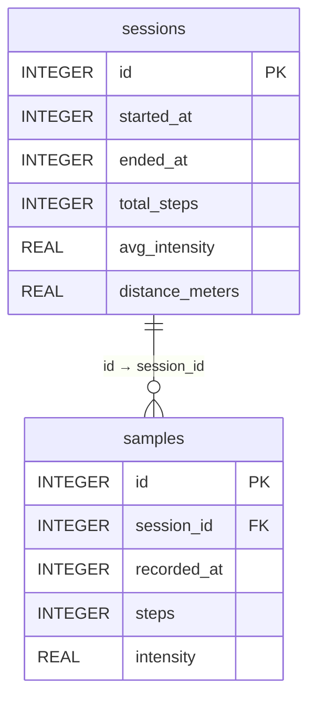

# Technická dokumentace — Activity Tracker

## Navigace

- [Zpět na README](./README.md)
- [Uživatelská příručka](./PRIRUCKA.md#uživatelská-příručka--activity-tracker)

---

## 1. Popis aplikace

Activity Tracker je mobilní aplikace pro platformy iOS a Android určená k záznamu fyzické aktivity uživatele. Aplikace zaznamenává počet kroků prostřednictvím systémového pedometru, intenzitu pohybu z dat akcelerometru a překonanou vzdálenost pomocí GPS. Naměřená data jsou persistentně ukládána v lokální SQLite databázi a lze je exportovat ve formátech CSV nebo JSON.

---

## 2. Technologický stack

| Technologie | Verze | Účel |
|---|---|---|
| React Native | 0.81.5 | Multiplatformní mobilní framework |
| Expo SDK | 54.0.34 | Sada nástrojů a knihoven pro React Native |
| Expo Router | 6.0.23 | Souborová navigace (file-based routing) |
| TypeScript | 5.9.2 | Staticky typovaný JavaScript |
| expo-sqlite | 16.0.10 | Lokální persistentní relační databáze |
| expo-sensors | 15.0.8 | Přístup k akcelerometru a pedometru |
| expo-location | 19.0.8 | GPS poloha a sledování trasy |
| expo-notifications | 0.32.17 | Plánování lokálních notifikací |
| expo-file-system | 19.0.22 | Zápis souborů na zařízení |
| expo-sharing | 14.0.8 | Sdílení souborů přes systémový dialog |
| react-native-chart-kit | 6.12.2 | Vizualizace dat — spojnicový graf |
| react-native-svg | 15.12.1 | Závislost knihovny react-native-chart-kit |

---

## 3. Struktura projektu

```
tracker/
├── app/                        # Expo Router — definice obrazovek
│   ├── _layout.tsx             # Kořenový layout, inicializace databáze
│   ├── (tabs)/
│   │   ├── _layout.tsx         # Layout tab navigace
│   │   ├── index.tsx           # Obrazovka aktivního měření
│   │   └── history.tsx         # Přehled uložených měření
│   └── session/
│       └── [id].tsx            # Detail měření — statistiky, graf, export
│
├── hooks/
│   └── useActivityTracker.ts   # React hook — řízení měření, senzory, GPS
│
├── lib/
│   ├── database.ts             # Databázová vrstva — schéma, CRUD operace
│   ├── notifications.ts        # Správa lokálních notifikací
│   ├── formatter.ts            # Pomocné funkce pro formátování dat
│   └── export.ts               # Export měření do CSV a JSON
│
├── constants/
│   └── constants.ts            # Aplikační konstanty a prahové hodnoty
│
└── assets/                     # Statické prostředky — ikony, splash screen
```

---

## 4. Datový model



### Tabulka `sessions`

| Sloupec | Typ | Popis |
|---|---|---|
| id | INTEGER PK | Primární klíč záznamu |
| started_at | INTEGER | Čas zahájení měření (Unix timestamp, ms) |
| ended_at | INTEGER | Čas ukončení měření (Unix timestamp, ms) |
| total_steps | INTEGER | Celkový počet kroků za měření |
| avg_intensity | REAL | Průměrná intenzita pohybu v rozsahu 0–1 |
| distance_meters | REAL | Celková překonaná vzdálenost v metrech |

### Tabulka `samples`

| Sloupec | Typ | Popis |
|---|---|---|
| id | INTEGER PK | Primární klíč záznamu |
| session_id | INTEGER FK | Cizí klíč odkazující na `sessions.id` |
| recorded_at | INTEGER | Čas pořízení vzorku (Unix timestamp, ms) |
| steps | INTEGER | Kumulativní počet kroků v okamžiku záznamu |
| intensity | REAL | Intenzita pohybu v okamžiku záznamu (0–1) |

Vzorky jsou ukládány v pravidelném intervalu definovaném konstantou `SAMPLE_INTERVAL_MS` (výchozí hodnota: 3 000 ms).

---

## 5. Implementace klíčových funkcí

### 5.1 Výpočet intenzity pohybu

Intenzita pohybu je odvozena z dat triaxiálního akcelerometru. Vypočítá se euklidovská norma vektoru zrychlení (magnitude), od níž se odečte hodnota klidové gravitace normalizované na 1g. Výsledek je lineárně normalizován do rozsahu 0–1.

```
mag = √(x² + y² + z²)
delta = |mag − 1.0|
intensity = min(delta / 2.0, 1.0)
```

Zdroj: [Android Sensor Documentation — Motion Sensors](https://developer.android.com/develop/sensors-and-location/sensors/sensors_motion)

### 5.2 Počítání kroků

Kroky jsou snímány systémovým pedometrem operačního systému prostřednictvím rozhraní `Pedometer.watchStepCount()` (iOS: CoreMotion, Android: Step Counter sensor). Při zahájení měření je zaznamenána výchozí hodnota čítače (baseline) z prvního přijatého callbacku. Všechny následující hodnoty jsou od baseline odečteny, čímž je zajištěno, že počet kroků začíná od nuly pro každé měření.

Zdroj: [Expo Pedometer API](https://docs.expo.dev/versions/latest/sdk/pedometer/)

### 5.3 Výpočet vzdálenosti — Haversine formula

Vzdálenost mezi po sobě jdoucími GPS souřadnicemi je počítána pomocí Haversine formule zohledňující sférický tvar Země.

```
a = sin²(Δlat/2) + cos(lat1) · cos(lat2) · sin²(Δlon/2)
c = 2 · atan2(√a, √(1−a))
d = R · c        // R = 6 371 000 m
```

Za účelem eliminace GPS šumu jsou ignorovány přírůstky vzdálenosti překračující 50 m za jeden měřicí interval.

Zdroj: [Movable Type Scripts — Calculate distance, bearing and more between Latitude/Longitude points](https://www.movable-type.co.uk/scripts/latlong.html)

### 5.4 Notifikace při neaktivitě

Po zahájení měření je naplánována lokální notifikace s prodlevou 300 sekund (5 minut). Při detekci pohybu přesahujícího prahovou intenzitu (`INTENSITY_THRESHOLD = 0.15`) je notifikace přeplánována. Aby nedocházelo k nadměrnému počtu volání plánovacího API, je přeplánování omezeno na maximálně jedno volání za 30 sekund (throttle). Při ukončení měření je případná naplánovaná notifikace zrušena.

---

## 6. Konfigurovatelné konstanty

Soubor `constants/constants.ts` centralizuje všechny aplikační konstanty:

| Konstanta | Výchozí hodnota | Popis |
|---|---|---|
| ACCEL_UPDATE_MS | 200 | Interval čtení dat akcelerometru (ms) |
| SAMPLE_INTERVAL_MS | 3 000 | Interval ukládání vzorků do databáze (ms) |
| GRAVITY | 1.0 | Referenční hodnota gravitace (normalizovaná) |
| INTENSITY_THRESHOLD | 0.15 | Minimální intenzita pro odložení notifikace |
| NOTIFICATION_DELAY_SECONDS | 300 | Prodleva notifikace při neaktivitě (s) |
| NOTIFICATION_THROTTLE_MS | 30 000 | Minimální interval přeplánování notifikace (ms) |
| LOCATION_UPDATE_MS | 5 000 | Interval GPS aktualizací (ms) |
| R_EARTH | 6 371 000 | Střední poloměr Země (m) |

---

## 7. Požadavky a instalace

### Systémové požadavky

- Node.js 18 nebo novější (ověřeno na verzi 24.16.0)
- npm
- Aplikace Expo Go nainstalovaná na fyzickém zařízení (iOS nebo Android)
- Fyzické zařízení je podmínkou pro plnou funkčnost — pedometr ani GPS nejsou dostupné na simulátorech a emulátorech

### Postup instalace

**1. Klonování repozitáře**
```bash
git clone <url-repozitare>
cd tracker
```

**2. Instalace závislostí**
```bash
npm install
```

**3. Spuštění vývojového serveru**
```bash
npx expo start
```

**4. Spuštění na zařízení**

Naskenujte QR kód v aplikaci Expo Go (Android) nebo fotoaparátem (iOS). Pokud jsou telefon a počítač připojeny ke stejné Wi-Fi síti, Expo Go aplikaci detekuje automaticky v sekci **Recently in Development**.

### Vyžadovaná oprávnění

| Oprávnění | Platforma | Účel |
|---|---|---|
| Motion & Fitness / ACTIVITY_RECOGNITION | iOS / Android | Přístup k systémovému pedometru |
| Location When In Use | iOS / Android | GPS sledování polohy |
| Notifications | iOS / Android | Zobrazení lokálních notifikací |

---

## 8. Platformní kompatibilita

| Funkce | iOS | Android |
|---|---|---|
| Pedometr | CoreMotion | Step Counter sensor |
| GPS | Podporováno | Podporováno |
| Lokální notifikace | Podporováno | Podporováno |
| Export a sdílení | Podporováno | Podporováno |
| Simulátor / emulátor | Pedometr a GPS nejsou dostupné | Pedometr a GPS nejsou dostupné |